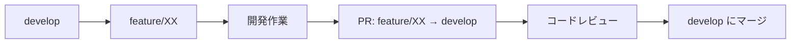
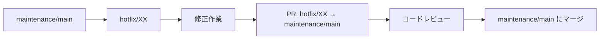
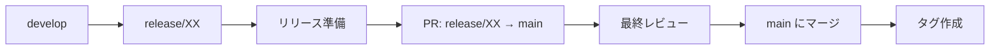

# Git戦略・ブランチ運用ドキュメント

## 概要
OpenCanapasAgent2025プロジェクトにおけるGit戦略とブランチ運用方針

## ブランチ構成

### メインブランチ

| ブランチ名 | 用途 | 説明 |
|-----------|------|------|
| `main` | 本番リリース | 安定版のコードベース。本番環境にデプロイされるコード |
| `develop` | 機能統合 | 新機能の統合とテスト。次回リリース準備用 |
| `maintenance/main` | 保守・修正 | バグ修正、セキュリティパッチ、緊急対応用 |

### 作業ブランチ

| ブランチ名 | 用途 | 命名規則 |
|-----------|------|----------|
| `feature/XX` | 新機能開発 | `feature/機能名` または `feature/issue番号` |
| `hotfix/XX` | 緊急修正 | `hotfix/修正内容` または `hotfix/issue番号` |
| `bugfix/XX` | バグ修正 | `bugfix/修正内容` または `bugfix/issue番号` |

## 開発フロー

### 1. 新機能開発



**手順:**
```bash
# 1. developブランチから作業ブランチを作成
git checkout develop
git pull origin develop
git checkout -b feature/新機能名

# 2. 開発作業
# コーディング、テスト作成...

# 3. コミット & プッシュ
git add .
git commit -m "feat: 新機能の説明"
git push origin feature/新機能名

# 4. GitHub上でPR作成 (feature/新機能名 → develop)
```

### 2. バグ修正・保守作業



**手順:**
```bash
# 1. maintenance/mainブランチから修正ブランチを作成
git checkout maintenance/main
git pull origin maintenance/main
git checkout -b hotfix/修正内容

# 2. 修正作業
# バグ修正、テスト追加...

# 3. コミット & プッシュ
git add .
git commit -m "fix: バグ修正の説明"
git push origin hotfix/修正内容

# 4. GitHub上でPR作成 (hotfix/修正内容 → maintenance/main)
```

### 3. リリース準備



**手順:**
```bash
# 1. developからリリースブランチを作成
git checkout develop
git pull origin develop
git checkout -b release/v1.0.0

# 2. リリース準備（バージョン更新、CHANGELOG等）
# 必要に応じて微調整...

# 3. mainにマージ後、タグ作成
git checkout main
git tag v1.0.0
git push origin v1.0.0
```

## プルリクエスト運用

### PR作成時のチェックリスト

- [ ] 適切なベースブランチを選択している
- [ ] PRタイトルがConventional Commitsに従っている
- [ ] 説明文に変更内容と理由を記載している
- [ ] テストが通ることを確認している
- [ ] コードフォーマット（Biome）が適用されている

### PRタイトルの命名規則

| プレフィックス | 用途 | 例 |
|----------------|------|-----|
| `feat:` | 新機能 | `feat: 音声認識機能の追加` |
| `fix:` | バグ修正 | `fix: チャット画面の表示崩れを修正` |
| `docs:` | ドキュメント | `docs: READMEの更新` |
| `style:` | フォーマット | `style: Biomeエラーの修正` |
| `refactor:` | リファクタリング | `refactor: API呼び出し処理の整理` |
| `test:` | テスト | `test: 単体テストの追加` |
| `chore:` | その他 | `chore: 依存関係の更新` |

## よく使うGitコマンド

### ブランチ操作

```bash
# ブランチ一覧表示
git branch -v

# リモートブランチも含めて表示
git branch -av

# ブランチ削除（ローカル）
git branch -d feature/完了した機能

# ブランチ削除（リモート）
git push origin --delete feature/完了した機能
```

### 同期・更新

```bash
# リモートの最新状態を取得
git fetch origin

# developブランチを最新に更新
git checkout develop
git pull origin develop

# 現在のブランチをdevelopの最新に合わせる
git rebase develop
```

### コミット

```bash
# ステージング
git add .

# コミット
git commit -m "feat: 新機能の説明"

# 直前のコミットメッセージを修正
git commit --amend -m "修正されたメッセージ"
```

## 緊急時の対応

### 本番で緊急バグが発生した場合

1. `maintenance/main`から`hotfix/緊急修正`を作成
2. 最小限の修正を実装
3. テスト実行後、即座にPR作成
4. 緊急レビュー後、`maintenance/main`にマージ
5. 必要に応じて`main`ブランチにも反映