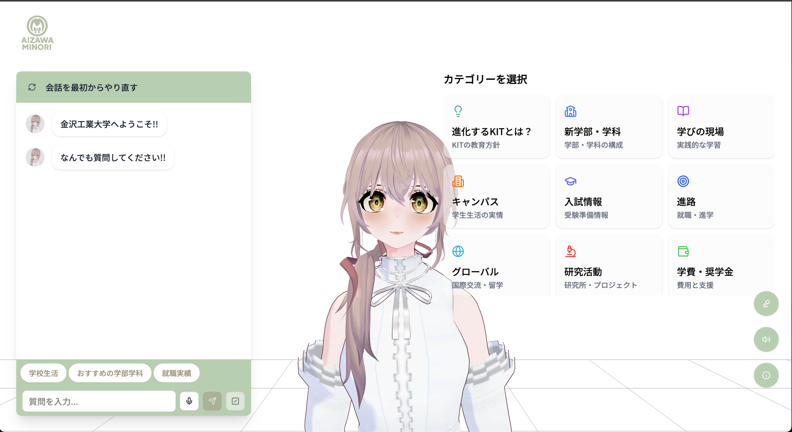

# KIT-VRM-ChatAgent

金沢工業大学情報工学科の3D VRMアバターを活用した対話型AIエージェント・システム。RAG（Retrieval-Augmented Generation）技術とLLMを組み合わせた日本語Q&Aシステムを、リアルな3D VRMアバターによる音声合成・感情表現・リップシンクで提供する次世代対話インターフェースです。



**オープンキャンパス2025での展示予定**  
**ホームページ**: https://www.aizawaminori.com/

---

## 目次
1. [主な機能](#主な機能)  
2. [技術スタック](#技術スタック)
3. [アーキテクチャ](#アーキテクチャ)  
4. [前提ソフトウェア](#前提ソフトウェア)  
5. [クイックスタート](#クイックスタート)  
6. [詳細セットアップ](#詳細セットアップ)
7. [開発コマンド](#開発コマンド)  
8. [プロジェクト構造](#プロジェクト構造)
9. [API仕様](#api仕様)
10. [FAQ・トラブルシューティング](#faqトラブルシューティング)

---

## 主な機能

### 3D VRMアバター システム
- **VRM 1.0/2.0 対応**: 高品質3Dアバターモデルの表示・制御
- **リアルタイムリップシンク**: 音声に同期した自然な口の動き
- **感情表現システム**: テキスト感情分析に基づく表情・ジェスチャー変化
- **VRMAアニメーション**: Idle、Thinking、ジェスチャーによる豊かな表現力

### 高度なAI対話システム  
- **RAG + LLM統合**: 検索拡張生成による高精度な日本語Q&A
- **ストリーミング応答**: リアルタイムでの応答生成・表示
- **カテゴリ別質問**: 学科・施設・入学情報等の構造化された質問システム
- **多言語対応**: 日本語・英語の動的切り替え（i18next）

### 音声・感情処理
- **双方向音声対話**: Web Speech API + Aivis Speech Engine
- **感情分析エンジン**: spaCy+ginza による日本語感情解析（ルールベース・ML・ハイブリッド）
- **Text-to-Speech**: 高品質音声合成とストリーミング再生
- **音声認識**: ブラウザベース音声入力

### 開発・運用基盤
- **マイクロサービス**: Docker Compose による統合管理
- **レスポンシブUI**: デスクトップ・モバイル最適化
- **GPU/CPU 柔軟対応**: ハードウェア環境に応じた自動最適化
- **モニタリング**: ヘルスチェック・ログ・パフォーマンス監視

## 技術スタック

### フロントエンド
- **React 19** + **TypeScript** - メインフレームワーク
- **Vite** - 高速開発ビルドツール
- **Three.js** + **@pixiv/three-vrm** - 3D VRMレンダリング
- **Tailwind CSS** + **shadcn/ui** - モダンUIデザイン
- **Jotai** - アトミック状態管理
- **i18next** - 多言語国際化
- **Framer Motion** - 高品質アニメーション
- **Vitest** + **Testing Library** - テスト環境

### バックエンド
- **FastAPI** + **Uvicorn** - 高性能非同期API
- **Docker Compose** - マイクロサービス管理
- **spaCy** + **ginza** - 日本語NLP・感情分析
- **ONNX Runtime** - 機械学習推論
- **Aivis Speech Engine** - 高品質TTS/STT
- **httpx** - 非同期HTTP通信
- **pytest** - テストフレームワーク

### 開発・品質管理
- **Biome** - コード品質・フォーマット
- **ESLint** - JavaScript/TypeScript静的解析
- **Lefthook** - Git フック管理
- **TypeScript** - 型安全性確保

## アーキテクチャ

### システム全体構成
```text
OpenCanapasAgent2025/
├── frontend/                    # React + Vite フロントエンドアプリ
│   ├── src/features/VRM/       # 3D VRMアバター制御
│   ├── src/features/ChatInterface/ # チャット・ストリーミング
│   ├── src/features/VoiceChat/ # 音声対話システム
│   ├── src/services/           # API統合・感情分析
│   ├── src/locales/           # 多言語翻訳ファイル
│   └── public/Model/          # VRMモデル・アニメーション
└── backend/                    # FastAPI バックエンドAPI
    ├── compose.yaml           # Docker Compose 設定
    └── fast-api/             # FastAPIアプリケーション
        ├── routers/          # APIエンドポイント
        ├── services/         # ビジネスロジック・AI統合
        └── data/            # 感情分析辞書・モデル
```

### マイクロサービス構成
```text
Docker Compose Services
├── FastAPI Service (Port 8000)
│   ├── LLM Integration & RAG
│   ├── 感情分析 (spaCy + ginza + ONNX)
│   ├── API エンドポイント
│   └── 外部LLM統合
└── Aivis Speech Engine (Port 10101)
    ├── Text-to-Speech 合成
    ├── Speech-to-Text 認識
    └── ストリーミング音声処理
```

### データフロー
```text
ユーザー入力
    ↓
[Frontend] React + Three.js VRM
    ↓ (HTTP/WebAPI)
[Backend] FastAPI
    ↓ (感情分析)
[spaCy + ginza] → [VRM表情制御]
    ↓ (LLM API)
[External LLM] → [ストリーミング応答]
    ↓ (TTS)
[Aivis Engine] → [音声合成 + リップシンク]
```


## 前提ソフトウェア

| ツール | バージョン | 備考 |
|--------|------------|------|
| **Node.js** | ≥ 18.0 | pnpm 8.0+ 推奨 |
| **pnpm** | ≥ 8.0 | `npm i -g pnpm` で導入 |
| **Docker** | ≥ 20.10 | Compose v2 必須 |
| **Docker Compose** | v2.0+ | `docker compose` コマンド |
| **GPU Driver (任意)** | CUDA 12+ | GPU版使用時のみ必要 |

> **Tip**: GPU非搭載環境でも `cpu-latest` イメージで動作するが、音声生成速度がやや低下

## クイックスタート

### 1. リポジトリ取得
```bash
git clone https://github.com/Yamamoto1012/OpenCanpasAgent2025.git
cd OpenCanapasAgent2025
```

### 2. バックエンド起動
```bash
cd backend
docker compose up -d
```

### 3. フロントエンド起動
```bash
cd ../frontend
pnpm install
pnpm dev
```

### 4. アクセス
- **フロントエンド**: http://localhost:5173
- **バックエンドAPI**: http://localhost:8000
- **Aivis Engine**: http://localhost:10101

## 詳細セットアップ

### 環境変数設定（任意）
`backend/.env` ファイルを作成:
```env
# LLM統合設定
DIFY_API_URL=your_llm_api_url
DIFY_API_KEY=your_api_key
DIFY_WORKFLOW_ID=your_workflow_id
DIFY_VOICE_WORKFLOW_ID=your_voice_workflow_id

# ストリーミング設定
ENABLE_STREAMING=true
STREAM_CHUNK_SIZE=1024
STREAM_TIMEOUT=60.0
VERIFY_SSL=false

# Aivis Engine設定
AIVIS_ENGINE_URL=http://aivis:10101
```

### GPU対応セットアップ
```bash
# 1. NVIDIA Docker Toolkit インストール (Ubuntu/CentOS)
# 2. compose.yaml のイメージタグ変更
cd backend
sed -i 's/cpu-latest/nvidia-latest/g' compose.yaml

# 3. GPU版で再起動
docker compose down
docker compose up -d --build
```

### 開発環境セットアップ
```bash
# フロントエンド開発環境
cd frontend
pnpm install
pnpm setup-hooks  # Git hooks セットアップ

# バックエンド開発環境（ローカル）
cd backend/fast-api
pip install -r requirements.txt
```

## 開発コマンド

### フロントエンド
```bash
cd frontend

# 開発・ビルド
pnpm dev                # 開発サーバー起動
pnpm build              # 本番ビルド
pnpm preview            # ビルド結果プレビュー
pnpm test               # テスト実行

# コード品質
pnpm lint               # ESLint
pnpm check:write        # Biome チェック + 自動修正
pnpm format:write       # Biome フォーマット
```

### バックエンド
```bash
cd backend

# サービス管理
docker compose up -d           # サービス起動
docker compose down            # サービス停止
docker compose logs -f         # ログ監視
docker compose build           # イメージ再ビルド

# 開発・デバッグ
docker compose exec fastapi bash    # コンテナ内シェル
docker compose exec fastapi pytest  # テスト実行
```

### 統合開発
```bash
# 全体ビルド・テスト
cd frontend && pnpm test && cd ../backend
docker compose exec fastapi pytest tests/

# ヘルスチェック
curl http://localhost:8000/health
curl http://localhost:10101/version
```

## プロジェクト構造

### フロントエンド詳細
```text
frontend/src/
├── features/              # 機能別コンポーネント
│   ├── VRM/              # VRMアバター制御
│   │   ├── LipSync/      # リップシンク機能
│   │   ├── VRMExpression/ # 表情管理
│   │   └── hooks/        # VRM関連フック
│   ├── ChatInterface/    # テキストチャット
│   ├── VoiceChat/        # 音声対話
│   ├── CategoryNavigator/ # カテゴリナビゲーション
│   └── LanguageSelector/ # 言語切り替え
├── services/             # API統合
│   ├── llmService.ts     # LLM API統合
│   └── sentimentService.ts # 感情分析API
├── store/                # Jotai状態管理
├── hooks/                # 汎用カスタムフック
├── locales/              # 多言語翻訳
│   ├── ja/              # 日本語
│   └── en/              # 英語
└── lib/                  # ユーティリティ
```

### バックエンド詳細
```text
backend/fast-api/
├── routers/              # FastAPI ルーター
│   ├── llm.py           # LLM統合エンドポイント
│   ├── sentiment.py     # 感情分析エンドポイント
│   ├── speech.py        # 音声処理エンドポイント
│   └── health.py        # ヘルスチェック
├── services/            # ビジネスロジック
│   ├── sentiment/       # 感情分析サービス
│   │   ├── analyzer.py         # 感情分析エンジン
│   │   ├── hybrid_analyzer.py  # ハイブリッド解析
│   │   ├── rule_based_analyzer.py # ルールベース
│   │   ├── onnx_analyzer.py    # ONNX ML解析
│   │   └── models/            # 学習済みモデル
│   ├── speech/         # 音声処理
│   └── engine/         # エンジン統合
├── data/               # データファイル
│   └── sentiment_dictionaries/ # 感情辞書
└── tests/              # テストファイル
```

## API仕様

### メインエンドポイント
| Method | Endpoint | 説明 |
|--------|----------|------|
| GET | `/health` | サービス稼働確認 |
| POST | `/api/llm/query` | テキスト質問処理 |
| POST | `/api/llm/voice_mode_answer` | 音声質問処理 |
| POST | `/sentiment/analyze` | 感情分析 |
| POST | `/speech/synthesize` | 音声合成 |

### リクエスト例
```bash
# テキスト質問
curl -X POST http://localhost:8000/api/llm/query \
  -H "Content-Type: application/json" \
  -d '{
    "query": "情報工学科について教えて",
    "context": "",
    "language": "ja"
  }'

# 感情分析
curl -X POST http://localhost:8000/sentiment/analyze \
  -H "Content-Type: application/json" \
  -d '{
    "text": "とても嬉しいです",
    "method": "hybrid"
  }'
```

## FAQ・トラブルシューティング

### よくある質問

<details>
<summary>ポート変更方法</summary>

**バックエンドポート変更（8000 → 8001）**:
1. `backend/compose.yaml` の fastapi ports を `"8001:8000"` に変更
2. フロントエンドの API URL を更新（環境変数 or service設定）

</details>

<details>
<summary>GPU加速の有効化</summary>

1. **NVIDIA Docker Toolkit** をインストール
2. `backend/compose.yaml` の aivis イメージを `nvidia-latest` に変更
3. `docker compose up -d --build` で再起動

</details>

<details>
<summary>多言語対応の拡張</summary>

1. `frontend/src/locales/` に新言語ディレクトリ作成
2. 各namespaceファイルを翻訳
3. `lib/i18n.ts` に言語設定追加

</details>

### トラブルシューティング

#### サービス起動エラー
```bash
# サービス状態確認
docker compose ps

# ログ確認
docker compose logs fastapi
docker compose logs aivis

# ポート競合確認
netstat -tulpn | grep -E ':(8000|10101|5173)'
```

#### VRM表示エラー
- **モデル読み込み失敗**: `public/Model/` パス確認・VRMファイル整合性
- **Three.js エラー**: ブラウザのWebGL対応確認
- **パフォーマンス低下**: ブラウザの Hardware Acceleration 有効化

#### 音声機能エラー
- **マイク権限**: ブラウザの音声入力許可確認
- **TTS不動作**: ブラウザの音声合成API対応確認
- **Aivis接続エラー**: `curl http://localhost:10101/version` で疎通確認

#### API接続エラー
```bash
# バックエンド疎通確認
curl http://localhost:8000/health

# CORS エラー確認
ブラウザ DevTools → Network タブで詳細確認

# 感情分析エラー
docker compose exec fastapi python -c "import spacy; spacy.load('ja_ginza_electra')"
```

---

**関連リンク**:
- [Frontend README](frontend/README.md)
- [Backend README](backend/README.md)
- [Architecture Documentation](docs/ARCHITECTURE.md)