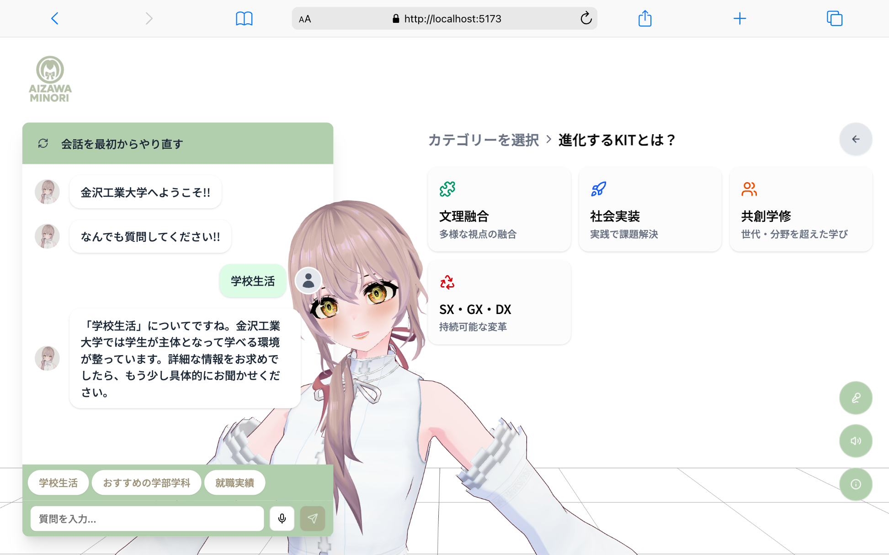
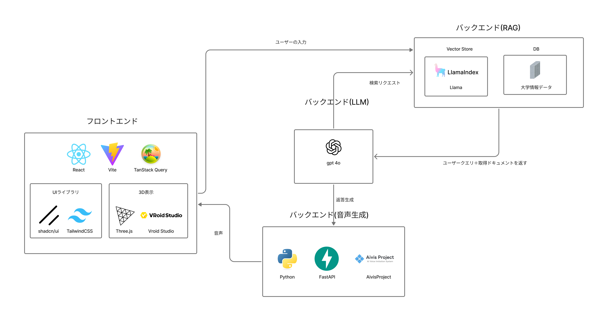

# OpenCanpasAgent2025

金沢工業大学 情報工学科 **中沢研究室** が春のオープンキャンパス 2025 で展示する、3D 美少女 AI エージェント・デモアプリケーションです。Retrieval‑Augmented Generation (RAG) と LLM による日本語 Q&A を、Three.js + VRM で動くアバター＆音声合成を通してリアルタイムに体験できます。
今後は、AWS等のクラウドに移行予定です。



ホームページはこちら  
https://www.aizawaminori.com/

---

## 目次
1. [主な機能](#主な機能)  
2. [アーキテクチャ](#アーキテクチャ)  
3. [前提ソフトウェア](#前提ソフトウェア)  
4. [ローカルセットアップ手順](#ローカルセットアップ手順)  
5. [起動方法](#起動方法)  
6. [よく使う開発コマンド](#よく使う開発コマンド)  
7. [ディレクトリ構成](#ディレクトリ構成)

---

## 主な機能
- **RAG + LLM** による高品質な日本語 Q&A
- **3D アバター (Three.js + VRM)** & リップシンクで臨場感ある応答
- **音声対話**: Web Speech API と Aivis Speech Engine を組み合わせた双方向ボイス
- **Docker Compose 一発起動**: バックエンド（FastAPI + Aivis Speech Engine）をまとめて立ち上げ
- **GPU／CPU 切替**: `compose.yaml` のイメージタグを `nvidia-latest` ↔︎ `cpu-latest` で簡単に変更可能

## アーキテクチャ
```text
OpenCanpasAgent2025/
├── frontend/      # React + Vite + TailwindCSS + Three.js
└── backend/
    ├── compose.yaml      # バックエンド全体を起動
    └── fast-api/        # FastAPI アプリ本体
```



<details>
<summary>コンテナ構成 (backend/compose.yaml)</summary>

```yaml
version: "3.8"
services:
  aivis:   # Aivis Speech Engine (音声合成 / 音声認識)
    image: ghcr.io/aivis-project/aivisspeech-engine:cpu-latest  # ← GPU 環境では :nvidia-latest に変更
    ports:
      - "10101:10101"
  fastapi: # RAG + LLM + REST API
    build: ./fast-api
    ports:
      - "8000:8000"   # ホスト側も 8000 で公開
    environment:
      - AIVIS_ENGINE_URL=http://aivis:10101
    depends_on:
      aivis:
        condition: service_healthy
```

</details>

## 前提ソフトウェア
| ツール | バージョン | 備考 |
| ------ | ---------- | ---- |
| **Node.js** | ≥ 20.x | `pnpm` 推奨 |
| **pnpm** | ≥ 8.x | `npm i -g pnpm` で導入可 |
| **Docker** | ≥ 24.x | Compose v2 同梱 |
| **GPU Driver (任意)** | 535+ | CUDA 12 系列。GPU を使わない場合は不要 |

> **Tip**: GPU が無い PC でも `cpu-latest` イメージでそのまま動作しますが、音声生成がやや遅くなります。

## ローカルセットアップ手順
```bash
# 1. リポジトリを取得
$ git clone https://github.com/Yamamoto1012/OpenCanpasAgent2025.git
$ cd OpenCanpasAgent2025

# 2. フロントエンド依存をインストール
$ cd frontend && pnpm install && cd ..

# 3. バックエンドイメージをビルド（初回のみ）
$ cd backend
$ docker compose build   # fast-api イメージのビルド
```

### 環境変数 (`backend/fast-api/.env`)
```env
# Aivis Speech Engine
AIVIS_ENGINE_URL=http://aivis:10101

# ----- 以下は必要に応じて設定してください ------
# 外部 LLM サービスを使う場合
LLM_API_URL=
LLM_ENDPOINT=/answer_query
LLM_TIMEOUT=30.0
```

## 起動方法
```bash
# バックエンド (FastAPI + Aivis Speech)
$ cd backend
$ docker compose up -d        # FastAPI → http://localhost:8000/

# フロントエンド
$ cd ../frontend
$ pnpm run dev                # Vite dev server → http://localhost:5173/
```
ブラウザで **http://localhost:5173** を開くとアプリが表示されます。

## よく使う開発コマンド
| ディレクトリ | コマンド | 説明 |
| ------------ | -------- | ---- |
| frontend | `pnpm test` | Vitest でユニットテスト実行 |
| frontend | `pnpm run format` | Biome でコード整形 |
| backend  | `docker compose logs -f` | バックエンドログを tail で確認 |
| backend  | `docker compose exec fastapi bash` | コンテナ内でデバッグ |

## ディレクトリ構成
```text
frontend/
├── public/               # 静的ファイル
├── src/
│   ├── app/              # App Router (Next.js v15 対応)
│   ├── components/       # Atomic components
│   ├── layouts/          # Re‑usable layouts
│   └── features/         # 機能ごとのモジュール
└── vitest.config.ts

backend/
├── compose.yaml          # Docker Compose 定義
└── fast-api/
    ├── main.py           # エントリポイント
    ├── routers/          # FastAPI ルーター
    ├── services.py       # RAG / TTS / STT ラッパ
    └── Dockerfile        # コンテナビルド定義
```

---

## FAQ
<details>
<summary>ポート番号を 8000 → 8001 に変更したい</summary>

`backend/compose.yaml` の `fastapi` サービス行を `- "8001:8000"` に書き換えてください。フロントエンドの `.env` または `LLM_API_URL` も合わせて変更が必要です。

</details>

<details>
<summary>GPU で推論したい</summary>

1. NVIDIA Docker Toolkit をインストール。
2. `backend/compose.yaml` の `aivis` イメージタグを `nvidia-latest` に変更。
3. `docker compose up -d --build` で再起動。

</details>
